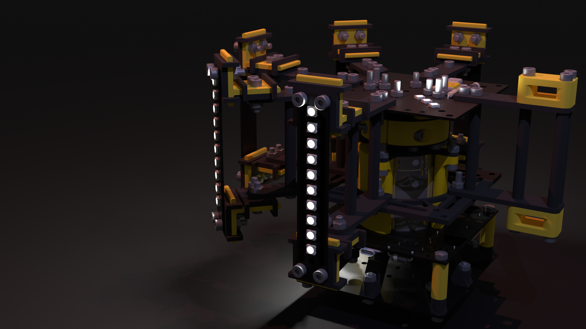

    <h2>Raven</h2>
    
by <a href= "https://github.com/HenryLi-0/raven"> @HenryLi-0 </a>

    

It's open sourced! Hardware licensed under CERN OHL S v2. Software licensed under GNU GPL v3.

---

## Raven

[Raven](https://github.com/HenryLi-0/raven/) is an open source spinning LED light display, built for (and generously funded by) Hack Club's [Highway](https://highway.hackclub.com/)!

## Introduction
Since being introduced to an LED strip during FRC at the start of 2024, I realized I really like LEDs. Like a little too much. This could also be seen with the 10 LEDs from my [Hackpad](https://github.com/hackclub/hackpad/pull/224) back in October 2024 and when I brought it on a robotics trip to BattleCry in June 2025 (iykyk). Simply, I kinda like LEDs a lot. 

Now inspired by the lights at the venue of the aforementioned robotics trip (and the lights show that occured near the end of the event), that brings us here! Introducting Raven, a spinning LED display that uses 50 LEDs spread across 5 panels, spinning *really* fast. Using a Hall Effect Sensor for speed measurement, the measured values for angular prediction, and wireless control for wireless communications, Raven is capable of producing sector-based effects, rainbow gradients, strobes, and more, with a full 360 degree range of the room, or any sector of it! Apart from being an almost disco ball of sorts, the mechanism itself allows it to also act as an LED light display, almost looking like some sort of Vegas Sphere, except as a cylinder.

This project took over a hundred hours to make (with tons of redesigns!), and, retrospectively, I guess it's just because I think LEDs look pretty cool. The idea of replicating what happened in the venue really kept me going, and, now staring at what's been created, I think those hours were worth it! Learned lots a things along the way, such as reading datasheets, power in general, and implementing stuff from the ground up!

## Long Description

Incase you wanted a full, long description, here it is!

Introducing Raven, an open source spinning LED light display! The system can be seperated into three parts: the motor subsystem, the LED control subsystem, and the LED panels. But first, what exactly is the idea behind Raven? Inspired by the light effects done at BattleCry 2025 at WPI (2025BC), along with really liking LEDs for some reason, I wanted to create a LED display that lights up an entire room. But a stationary system wouldn't create the desired effect, the effect to slice up the room into different colors. For example, imagine the left side of the room being red and the right being blue.

This is accomplished by having 5 LED panels, each with 10 LEDs each, vertically stacked, pointing outwards. These 5 panels form a 180 degree circle, each panel spaced 45 degrees off the next. Arms connecting to the top and bottom of the LED panels attach to a center. Spacers keep these top and bottom arms in position. In the center, the top arms connect to the LED control PCB, which contains a XIAO ESP32-C3. This board is also equipped with a Hall Effect Sensor, used to be a simple way to measure RPM without an expensive encoder. This entire section spins on a shaft collar connected to a 775 motor. Additionally, a 18650 Li-ion battery is on this section, powering the whole thing without need for a power wire.

In order to save on costs, a slip ring was strongly avoided during design. Instead, the motor subsystem powers the motor with 4 Li-ion batteries, supplying a total of 14.8-16.8V @20A to the motor. 4 Li-ion batteries was choosen as a solution to the problem with finding suitable boost converters, which were either incapable of handling 20A, or are just really expensive. In fact, it is actually cheaper to use 4 Li-ion batteries than a single one of these boost converters. This solution also gave the benefit of having additional battery time, which was a nice side bonus. The motor subsystem is stationary, with the base being a copy of the LED control subsystem's PCB. This empty PCB is used as the FR-4 material of the PCB is likely stronger than PLA parts, while also being a smart way to reuse the multiple PCBs sent by JLCPCB. This is also the reason why there are 5 LED panels, as to minimize waste. The motor subsystem is also powered with a XIAO ESP32-C3, and has its own Hall Effect Sensor to measure the RPM of the LED subsystem.

The control system starts at the stationary motor subsystem microcontroller, which sends a constant ping to the LED subsystem's microcontroller. The LED subsystem reads this ping through the ESP32's bluetooth capabilities, and also sends a ping back. Both systems need to listen to each other in order to think they are operating properly. In the event that a ping isn't heard in a long time, the LED subsystem will stop operating and the motor subsystem will attempt to bring the motor to a stop. While operating properly, the LED subsystem uses a mix of data from the motor subsystem's Hall Effect Sensor and the LED subsystem's Hall Effect Sensor to calculate its speed and position, utilizing a model of the motor's speed. The motor subsystem will use PID control with a MOSFET to ensure that the LED subsystem reaches the proper spin.

This entire system is packaged inside a cylinderical shape with diameter of roughly 24 cm and a height of roughly 15 cm. The LED subsystem, weighing less than 2 pounds, plans to spin at anywhere from 1k-2k RPM, in order to achieve a speed where the LEDs essentially blend into a blur. The LED subsytem is loaded with almost 120 screws, in order to ensure that the LED subsystem stays in place. Additionally, all batteries are protected inside an over-discharge protection board and charged with a TP4056 module with protection (the TP4056 does NOT provide power to the system, it is only used for charging.).

And that's Raven, an open source spinning light display!

## Directory

Wanna know more? Here's some quick places to get started!

- [CAD](</CAD/README.md>)
    - We used OnShape for this, but you can grab files here too! (Although, poking around the CAD is probably better to have an idea of what things look like!)
- [PCB](</PCB/README.md>)
    - We have three different PCBs, have a look at them! They were created in KiCad v8.0.8 (yeah I know I'm a whole major version behind.)
- [Firmware](</firmware/README.md>)
    - We have two firmwares, one for each subsystem! (These firmwares are written for CircuitPython! Look here for deeper instructions!)
- [Journal](</JOURNAL.md>)
    - Wanna know the thought process behind stuff? Or just a really long read? Check out the journal! (or the [`updatelogs`](/updatelogs/) for everything in different files...)
- [BOM](</BOM.csv>)
    - Wanna make your own copy of Raven? Here's the BOM in CSV format! (You can look at [`BOM.md`](</BOM.md>) for a markdown version of it, but it won't be too descriptive!) (Or just scroll down.)

## Assembly!

1. First things first, it's recommended that you pull up the [CAD](</CAD/README.md>) and get familiar with how things look, and think of the order of steps. Special attention should be paid towards making sure that it is possible to put together, along with wires being able to "fit". Use logic to figure out whether a wire will be inside a part!
2. We're gonna assemble all the PCBs first! Pull up the [PCB](</PCB/README.md>) on KiCad for the PCBs themselves. Where things should be placed should be clear in the drawing! Do NOT solder the Hall Effect Sensors on!
3. Test the boards! It'll be easier now before it's in an awkward position!
4. Back to the CAD, assemble the LED subsystem structure! This should be quite simple, but just very tedious, as there are are a lot of parts and screws.
5. Assemble the shaft collar and the motor subsystem structure!
6. Ok, place that all aside for now. It's time to do the power systems for both! While doing this, reference the electronics wiring drawn below! Also note the names of the nets in KiCad.
7. Check solder joints!!! Everything on the LED subsystem MUST be ziptied (or you will risk something flying off). After this, start finding the center of gravity of the LED subsystem and try to balance it in the center (important).
8. After this, assemble everything together! Note the CAD and the epic image above!
9. Test that each system works individually! If so, head on over to the [firmware](</firmware/README.md>) and flash both of them!
10. Enjoy and check back for any firmware/general updates!

## BOM
*The Bill of Materials for x1 unit of Raven!*

Note: For this list, the prices are as of July 2025. Depending on certain actions on certain people, this may fluctuate over the next couple months/years. Current calculations have shipping and tax included, but if you want to see how much everything actual ended up costing me (as in, trying to use all the deals), look out for `updatelogs` during construction time! Below, things are grouped up by source and bolded with the sum of all the prices under group. Stuff in italics are added up in the bolded prices, so don't count them twice!

### Structure
*structural bits*

| Part                          | Price         | Link          |
|-------------------------------|---------------|---------------|
| **STRUCTURAL ALIEXPRESS**     | **$22.75**    | AliExpress    |
| *M4 Screws (x20, 40mm)*       | *$2.85*       | [AliExpress](https://www.aliexpress.us/item/3256804341271555.html) |
| *M4 Screws (x20, 30mm)*       | *$2.49*       | ^^^           |
| *M4 Screws (x80, 16mm)*       | *$7.96*       | ^^^           |
| *M4 Nuts (x125)*              | *$9.45*       | [AliExpress](https://www.aliexpress.us/item/3256807407546447.html) |
| *Shipping (to NYC)*           | *$0.00*       | (AliExpress)  |
| **3D Printed Parts**          | **$0.00**     | (self print)  |

### PCBs
*pcbs*

| Part                          | Price         | Link          |
|-------------------------------|---------------|---------------|
| **ALL PCBS FROM JLCPCB**      | **$20.30**    | JLCPCB        |
| *LED Panels (min 5)*          | *$2.10*       | ^^^           |
| *LED Subsystem (min 5)*       | *$4.00*       | ^^^           |
| *Motor Subsystem (min 5)*     | *$4.00*       | ^^^           |
| *Shipping (to NYC)*           | *$10.20*      | ^^^           |

### Small Electronics
*small stuff like microcontrollers and resistors*

| Part                          | Price         | Link          |
|-------------------------------|---------------|---------------|
| **ALL MICROCONTROLLERS**      | **$19.00**    | [Seeed Studio](https://www.seeedstudio.com/Seeed-XIAO-ESP32C3-p-5431.html) |
| *XIAO ESP32-C3 (x2)*          | *$10.00*      | ^^^           |
| *Shipping (to NYC)*           | ~*$9.00*      | ^^^           | (need to find better options)
| **LCSC Parts**                | **$21.29**    | LCSC          |
| *A3144 (min 5)*               | *$1.18*       | [LCSC](https://lcsc.com/product-detail/Hall-Switches_JSMSEMI-A3144EUA-T-JSM_C18188954.html) |
| *30SQ045 (x3)*                | *$1.76*       | [LCSC](https://lcsc.com/product-detail/Schottky-Diodes_LGE-30SQ045_C2903878.html) |
| *WS2812B (x65, mul 5)*        | *$4.28*       | [LCSC](https://lcsc.com/product-detail/RGB-LEDs-Built-in-IC_Worldsemi-WS2812B-B-W_C114586.html) |
| *1N4148 (x2, min 20)*         | *$0.51*       | [LCSC](https://lcsc.com/product-detail/Switching-Diodes_onsemi-1N4148_C258182.html) |
| *PR01000101002JA100 (min 5)*  | *$0.60*       | [LCSC](https://lcsc.com/product-detail/Through-Hole-Resistors_VISHAY-PR01000101002JA100_C1366567.html) |
| *MF1W-100Ω±1% T (min 10)*     | *$0.45*       | [LCSC](https://lcsc.com/product-detail/Through-Hole-Resistors_CCO-Chian-Chia-Elec-MF1W-100-1-T_C119469.html) |
| *1N5822 (x2, min 5)*          | *$0.51*       | [LCSC](https://lcsc.com/product-detail/Schottky-Diodes_MDD-Microdiode-Semiconductor-1N5822_C2476.html) |
| *Handling Fee*                | *$3.00*       | LCSC          |
| *Shipping (to NYC)*           | ~*$9.00*      | LCSC          |

### Big Electronics
*big stuff like motors and batteries*

Note: Try to use the AliExpress Welcome Deal on the 775 Motor and take advantage of a current sale on the batteries (drops all the batteries down to ~$26, including shipping and taxes)! (Batteries are currently calulated with the discount.)

| Part                          | Price         | Link          |
|-------------------------------|---------------|---------------|
| **ELECTRICAL ALIEXPRESS**     | **$46.69**    | AliExpress    |
| *775 Motor (288W, 12k)*       | *$17.65*      | [AliExpress](https://www.aliexpress.us/item/3256807114067845.html) |
| *Overdischarge (1S 16A)*      | *$1.26*       | [AliExpress](https://www.aliexpress.us/item/3256805852468677.html) |
| *Overdischarge (4S 20A std.)* | *$5.89*       | [AliExpress](https://www.aliexpress.us/item/3256806720463818.html) |
| *LM2596 (x1, Step Down)*      | *$1.76*       | [AliExpress](https://www.aliexpress.us/item/3256805963034065.html) |
| *XL6019 (x1, Step Up)*        | *$2.04*       | [AliExpress](https://www.aliexpress.us/item/2255800011462620.html) |
| *TP4056 (x5, USB-C, safety)*  | *$2.70*       | [AliExpress](https://www.aliexpress.us/item/3256807959506419.html) |
| *22 AWG wire (5m, 1 roll)*    | *$2.02*       | [AliExpress](https://www.aliexpress.us/item/3256807263561521.html) |
| *10 AWG wire (1m, Black)*     | *$6.86*       | [AliExpress](https://www.aliexpress.us/item/3256807572728671.html) |
| *Battery Holder (x1, 1B)*     | *$2.79*       | [AliExpress](https://www.aliexpress.us/item/3256806864993334.html) |
| *Battery Holder (x1, 4B)*     | *$3.72*       | [AliExpress](https://www.aliexpress.us/item/3256806864993334.html) |
| *Shipping (to NYC)*           | *$0.00*       | (AliExpress)  |
| **BATTERIES**                 | **$26.23**    | IMR Batteries |
| *Samsung 25R 18650...*        | *$15.00*      | [IMR Batteries](https://imrbatteries.com/products/samsung-25r-18650-2500mah-20a-battery) |
| *Shipping (to NYC)*           | *$9.13*       | ^^^           |
| *Taxes*                       | *$2.07*       | ^^^           |

### Total
*a + b = c*

| Group                         | Price         |
|-------------------------------|---------------|
| STRUCTURAL ALIEXPRESS         | $22.75        |
| 3D Printed Parts              | $0            |
| ALL PCBS FROM JLCPCB          | $20.30        |
| ALL MICROCONTROLLERS          | $19.00        |
| LCSC Parts                    | $21.29        |
| ELECTRICAL ALIEXPRESS         | $46.69        |
| BATTERIES                     | $26.23        |
| BUFFER                        | $5.00         |
| **TOTAL**                     | **$161.26**   |
